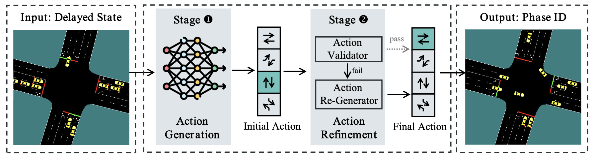
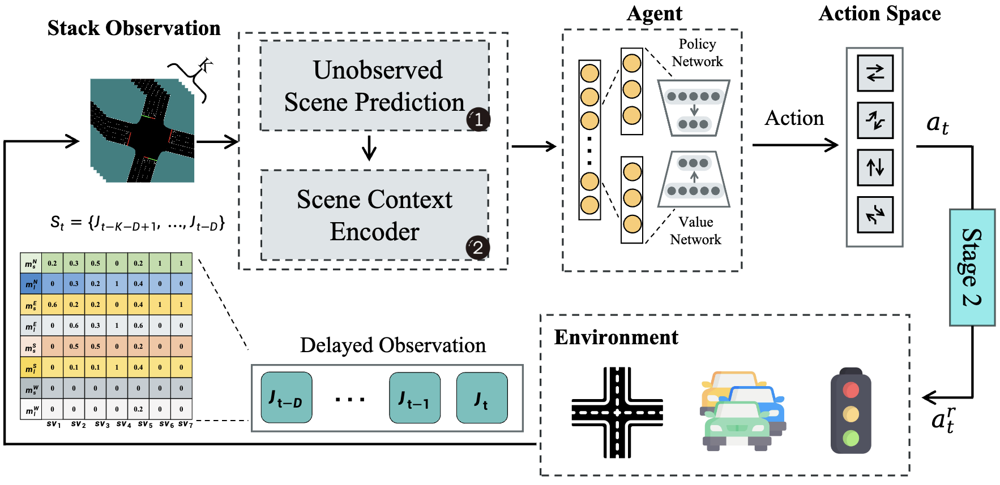
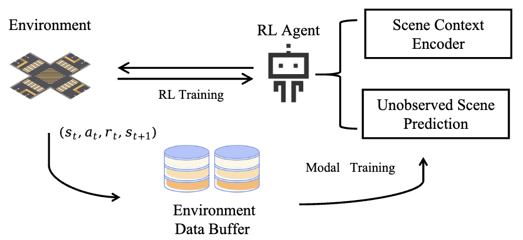

<!--
 * @Author: pangay 1623253042@qq.com
 * @Date: 2024-03-17 19:57:27
 * @LastEditors: pangay 1623253042@qq.com
 * @LastEditTime: 2024-03-17 20:04:01
 * @FilePath: /TSC-DelayLight/README.md
 * @Description: 这是默认设置,请设置`customMade`, 打开koroFileHeader查看配置 进行设置: https://github.com/OBKoro1/koro1FileHeader/wiki/%E9%85%8D%E7%BD%AE
-->
# Scalable Reinforcement Learning Framework for Traffic Signal Control under Communication Delays

## Info
This study proposes a two-stage framework to address observation delay in TSC.  In the first stage, a scene prediction module and a scene context encoder are utilized to process historical and current traffic data to generate preliminary traffic signal actions. In the second stage, an action refinement module, informed by human-defined traffic rules and real-time traffic metrics, adjusts the preliminary actions to account for the latency in observations. This modular design allows device deployment with varying computational resources while facilitating system customization, ensuring both adaptability and scalability, particularly in edge-computing environments. 

<div align=center>


Schematic of the two-stage RL-based TSC framework with delay mitigation.
</div>

<div align=center>


Illustration of the RL training process within the action generation stage (Stage 1). 
</div>
<div align=center>


The Predict-LSTM training process within the RL framework.
</div>

## Getting Start
### Run model locally

- `train.py`，train model；
- - **Example**：
```bash
python train.py --stack=6 --delay=0 --model_name=scnn --net_env=train_four_345 --net_name=4phases.net.xml
```

- - **model zoo**： scnn ernn eattention ecnn inference predict 

- - **env**：‘train_four_3  3phases.net.xml‘  ’train_four_345 4phases.net.xml‘ ’train_four_345 6phases.

- `test.py`, Test the trained model, specify the type of model, and the name of the environment to be tested, the test environment needs to have junction type and phase selection The model reads the model trained at delay=0 by default when reading, you can change it by yourself.

- - **Example**：
```bash
python test.py --stack=6 --delay=0 --model_name=ernn --net_name=train_four_3 
```
### predict model

- `FlowData_create.py`,Traffic flow data generation for predictive model training.
- `RNN_predict.py`, Used to train the traffic prediction model, here used is LSTM.
- `train_predict.py`, For LSTM-based prediction and RL model training.

## License and Citation <a name="licenseandcitation"></a>
All assets and code in this repository are under the [Apache 2.0 license](./LICENSE) unless specified otherwise. The language data is under [CC BY-NC-SA 4.0](https://creativecommons.org/licenses/by-nc-sa/4.0/). Other datasets (including nuScenes) inherit their own distribution licenses. Please consider citing our paper and project if they help your research.

```BibTeX
@article{pang2024scalable,
  title={Scalable Reinforcement Learning Framework for Traffic Signal Control under Communication Delays},
  author={Pang, Aoyu and Wang, Maonan and Chen, Yirong and Pun, Man-On and Lepech, Michael},
  journal={IEEE Open Journal of Vehicular Technology},
  year={2024},
  publisher={IEEE}
}
```
## Scripts

The script files used for training can be found in scripts. 

## Acknowledgment

感谢滕羽菲对画图工作进行的帮助，她非常善良可爱，乐于助人 
